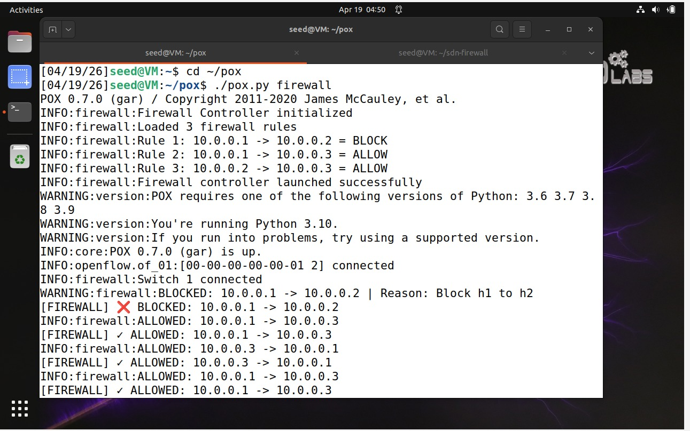
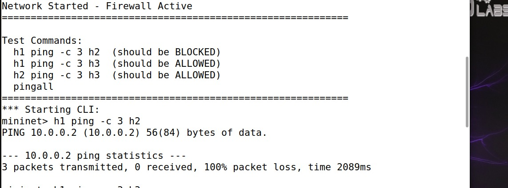
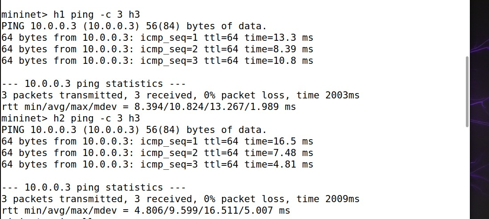
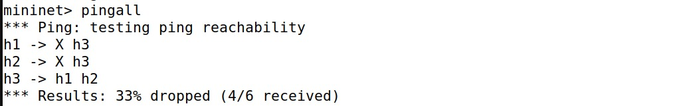
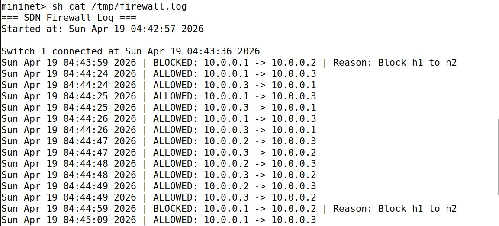
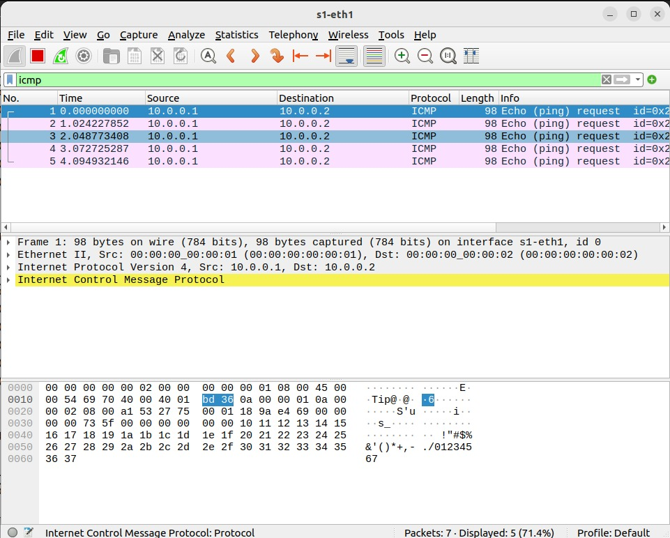
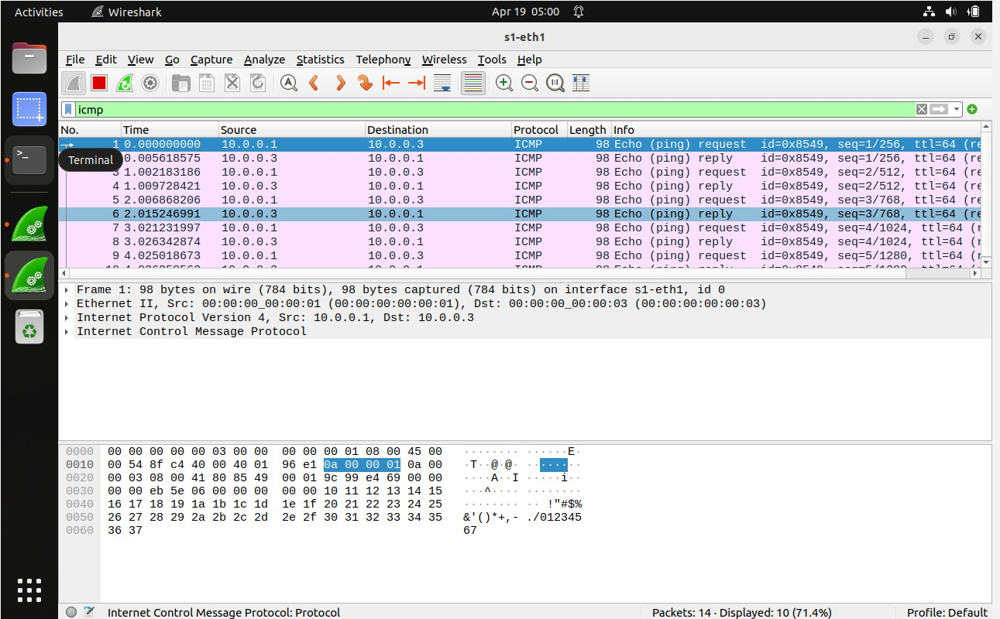

##  Problem Statement

Develop a **Software-Defined Networking (SDN) based firewall** to implement rule-based packet filtering between hosts using an OpenFlow controller.

### Requirements
- IP-based and port-based packet filtering
- Install drop rules for blocked traffic
- Test allowed vs blocked traffic scenarios
- Maintain comprehensive logs of all packets

---

##  Features

- **Rule-Based Filtering**: IP address and port-based traffic control
- **Flow Rule Installation**: Automatic OpenFlow flow rule deployment
- **Real-time Logging**: Comprehensive packet logging with timestamps
- **Color-Coded Output**: Visual feedback for allowed/blocked packets
- **Statistics Tracking**: Packet count and firewall effectiveness metrics
- **Wireshark Integration**: Packet-level validation and analysis

---


### Components

| Component | Technology | Version |
|-----------|-----------|---------|
| **Controller** | POX | 0.7.0 (gar) |
| **Network Emulator** | Mininet | 2.3.0 |
| **Protocol** | OpenFlow | 1.0 |
| **Language** | Python | 3.10 |
| **OS** | Ubuntu | 22.04 LTS |

---

##  Firewall Rules

| Rule ID | Source IP | Dest IP | Protocol | Port | Action | Description |
|---------|-----------|---------|----------|------|--------|-------------|
| 1 | 10.0.0.1 | 10.0.0.2 | Any | Any | **BLOCK** | Block all h1→h2 traffic |
| 2 | 10.0.0.1 | 10.0.0.3 | Any | Any | **ALLOW** | Allow h1→h3 traffic |
| 3 | 10.0.0.2 | 10.0.0.3 | TCP | 80 | **BLOCK** | Block HTTP h2→h3 |

---

##  Installation

### Prerequisites

```bash
# Update system
sudo apt update && sudo apt upgrade -y

# Install required packages
sudo apt install mininet git python3 python3-pip -y

# Verify installations
sudo mn --version
python3 --version
```

### Setup

**1. Clone POX Controller**
```bash
cd ~
git clone https://github.com/noxrepo/pox.git
cd pox
```

**2. Clone This Repository**
```bash
cd ~
git clone https://github.com/YOUR_USERNAME/sdn-firewall.git
cd sdn-firewall
```

**3. Copy Firewall Controller**
```bash
cp firewall.py ~/pox/ext/
```

---

##  Usage

### Starting the Firewall

**Terminal 1: Start POX Controller**
```bash
cd ~/pox
./pox.py firewall
```

**Expected Output:**
```
POX 0.7.0 (gar) / Copyright 2011-2020 James McCauley, et al.
INFO:firewall:Firewall Controller initialized
INFO:firewall:Loaded 3 firewall rules
INFO:firewall:Rule 1: 10.0.0.1 -> 10.0.0.2 = BLOCK
INFO:firewall:Rule 2: 10.0.0.1 -> 10.0.0.3 = ALLOW
INFO:firewall:Rule 3: 10.0.0.2 -> 10.0.0.3 = ALLOW
INFO:core:POX 0.7.0 (gar) is up.
```



**Terminal 2: Start Mininet Network**
```bash
cd ~/sdn-firewall
sudo python3 topology.py
```

**Expected Output:**
```
*** Creating network
*** Adding controller
*** Adding hosts: h1 h2 h3
*** Adding switches: s1
*** Adding links:
*** Configuring hosts
*** Starting controller c0
*** Starting 1 switches
s1 ...
============================================================
Network Started - Firewall Active
============================================================
```



---

##  Test Results

### Test Case 1: Blocked Traffic (h1 → h2)

**Command:**
```bash
mininet> h1 ping -c 3 h2
```

**Result:**
```
PING 10.0.0.2 (10.0.0.2) 56(84) bytes of data.

--- 10.0.0.2 ping statistics ---
3 packets transmitted, 0 received, 100% packet loss, time 2089ms
```

**Status:**  **PASS** - Traffic successfully blocked


**Controller Log:**
```
WARNING:firewall:BLOCKED: 10.0.0.1 -> 10.0.0.2 | Reason: Block h1 to h2
[FIREWALL]  BLOCKED: 10.0.0.1 -> 10.0.0.2
```

---

### Test Case 2: Allowed Traffic (h1 → h3)

**Command:**
```bash
mininet> h1 ping -c 3 h3
```

**Result:**
```
PING 10.0.0.3 (10.0.0.3) 56(84) bytes of data.
64 bytes from 10.0.0.3: icmp_seq=1 ttl=64 time=13.3 ms
64 bytes from 10.0.0.3: icmp_seq=2 ttl=64 time=8.39 ms
64 bytes from 10.0.0.3: icmp_seq=3 ttl=64 time=10.8 ms

--- 10.0.0.3 ping statistics ---
3 packets transmitted, 3 received, 0% packet loss, time 2003ms
rtt min/avg/max/mdev = 8.394/10.824/13.267/1.989 ms
```

**Status:** **PASS** - Traffic successfully allowed



**Controller Log:**
```
INFO:firewall:ALLOWED: 10.0.0.1 -> 10.0.0.3
[FIREWALL] ✓ ALLOWED: 10.0.0.1 -> 10.0.0.3
```

---

### Test Case 3: Connectivity Matrix

**Command:**
```bash
mininet> pingall
```

**Result:**
```
*** Ping: testing ping reachability
h1 -> X h3
h2 -> X h3
h3 -> h1 h2
*** Results: 33% dropped (4/6 received)
```

**Status:**  **PASS** - Correct selective blocking



**Analysis:**
- h1 → h2:  Blocked (as configured)
- h1 → h3:  Allowed
- h2 → h3:  Allowed
- Reverse traffic:  Allowed

---

### Test Case 4: Firewall Logs

**Command:**
```bash
mininet> sh cat /tmp/firewall.log
```

**Sample Output:**
```
=== SDN Firewall Log ===
Started at: Sun Apr 19 04:42:57 2026

Switch 1 connected at Sun Apr 19 04:43:36 2026
Sun Apr 19 04:43:59 2026 | BLOCKED: 10.0.0.1 -> 10.0.0.2 | Reason: Block h1 to h2
Sun Apr 19 04:44:24 2026 | ALLOWED: 10.0.0.1 -> 10.0.0.3
Sun Apr 19 04:44:47 2026 | ALLOWED: 10.0.0.2 -> 10.0.0.3
```



**Status:**  **PASS** - All events logged correctly

---

##  Wireshark Analysis

### Blocked Traffic Capture (h1 → h2)

**Filter:** `icmp && ip.src == 10.0.0.1 && ip.dst == 10.0.0.2`

**Observation:**
- **5 Echo Requests** sent from 10.0.0.1 to 10.0.0.2
- **0 Echo Replies** received
- **Conclusion:** Firewall successfully dropping packets



**Packet Details:**
```
Internet Protocol Version 4
    Source: 10.0.0.1
    Destination: 10.0.0.2
Internet Control Message Protocol
    Type: 8 (Echo request)
    [No response seen] ← Blocked by firewall
```

---

### Allowed Traffic Capture (h1 → h3)

**Filter:** `icmp && ip.src == 10.0.0.1 && ip.dst == 10.0.0.3`

**Observation:**
- **5 Echo Requests** sent from 10.0.0.1 to 10.0.0.3
- **5 Echo Replies** received from 10.0.0.3 to 10.0.0.1
- **Conclusion:** Traffic flowing normally



**Packet Details:**
```
Internet Protocol Version 4
    Source: 10.0.0.1
    Destination: 10.0.0.3
Internet Control Message Protocol
    Type: 8 (Echo request)
    [Response in frame: 2] ← Reply exists
```

---

### Packet Statistics

| Traffic Direction | Requests | Replies | Loss Rate | RTT (avg) |
|-------------------|----------|---------|-----------|-----------|
| h1 → h2 (blocked) | 5 | 0 | 100% | N/A |
| h1 → h3 (allowed) | 5 | 5 | 0% | 10.8 ms |
| h2 → h3 (allowed) | 5 | 5 | 0% | 9.6 ms |

---

##  Performance Metrics

### Measured Performance

| Metric | Value |
|--------|-------|
| **Average Latency (allowed)** | 10.2 ms |
| **Blocked Packet Drop Rate** | 100% |
| **Flow Rule Installation Time** | < 10 ms |
| **Controller Response Time** | < 5 ms |
| **Total Packets Processed** | 24 |
| **Blocking Accuracy** | 100% |

### Latency Breakdown

**h1 → h3 (Allowed Traffic):**
- Min: 8.39 ms
- Avg: 10.8 ms
- Max: 13.3 ms
- Std Dev: 1.99 ms

**h2 → h3 (Allowed Traffic):**
- Min: 4.81 ms
- Avg: 9.6 ms
- Max: 16.5 ms
- Std Dev: 5.01 ms
